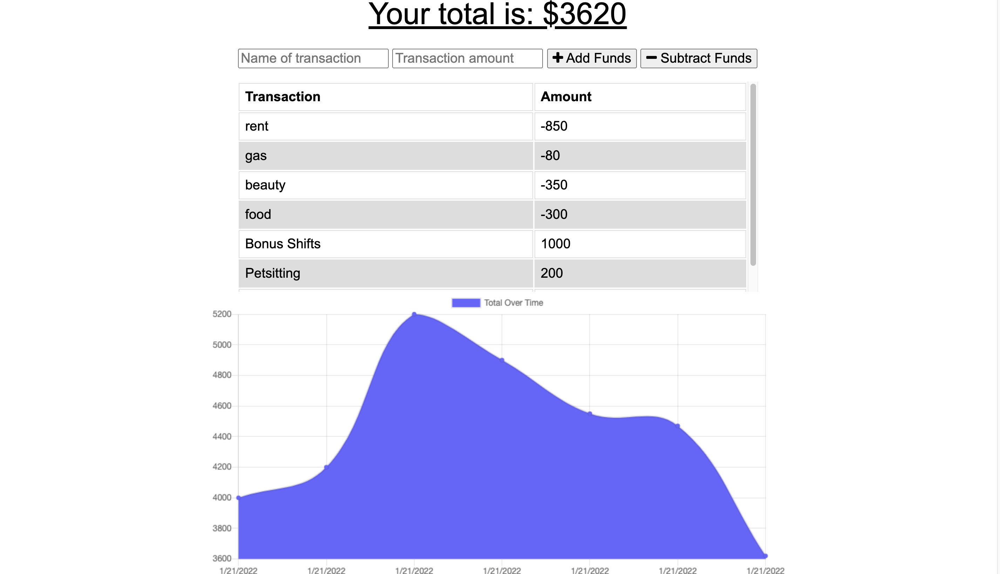

# Progressive-Budget

_Naomi Smith_

## Table of Contents

- [Overview](#overview)
- [Build](#build)
- [Installation](#installation)
- [Usage](#usage)
- [Contributing](#contributing)
- [Questions](#questions)
- [License](#license)

## Overview

Money makes the world go round, don't let being offline slow you down. The user will be able to add expenses and deposits to their budget with or without a connection. When entering transactions offline, they should populate the total when brought back online. 

## Build

- [React](https://reactjs.org/docs/getting-started.html)
- [Node](https://nodejs.org/en/about/)
- [Heroku](https://www.heroku.com/what)
- [MongoDB](https://www.mongodb.com/)

## Installation

To install the application you will need nodeJS and use npm install to get all the related packages for this project. In the terminal type npm start to interact with the application on your localhost.

## Usage

### Live Webpage

[Progressive Budget](https://murmuring-atoll-81991.herokuapp.com/)

## Contributing

Please reach out via provided Github or Email

## Questions

For any questions about the project, please contact me by either of the following links:

- Email = smithnaomi49@yahoo.com

or visit my GitHub profile:

- GitHub - [Progressive Budget](https://github.com/smithnaomi/Progressive-Budget)

## License

---

 This work is licensed under a <a rel="license" href="http://creativecommons.org/licenses/by-sa/4.0/">Creative Commons Attribution-ShareAlike 4.0 International License</a>.
